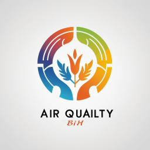

 

# 🌍 AQBIH_telegram_bot

Welcome to **AQBIH_Bot**, your reliable source for real-time air pollution data in Bosnia and Herzegovina. Stay informed about the air you breathe and make healthier choices for yourself and your community.

## 🔑 Key Features:

📊 Live Air Quality Data: Receive up-to-the-minute air quality updates for various locations across Bosnia and Herzegovina. Our bot fetches data from trusted goverment sources [FHMZBIH](https://fhmzbih.gov.ba/) and [RHMZRS](https://rhmzrs.com/) to provide you with accurate and reliable information.

📍 Location-Specific Reports: Get personalized air quality reports based on your chosen location. Whether you're in Sarajevo, Banja Luka, or any other city, **AQBIH_Bot** tailors information to your specific area.

<!-- 📈 Historical Trends: Track the historical trends of air quality in your region. Understand how pollution levels change over time and plan your activities accordingly. -->

<!-- 🚦 Alerts and Notifications: Set up personalized alerts to receive notifications when air quality reaches certain thresholds. Be proactive in managing your exposure to pollutants. -->

<!-- 🌐 Educational Insights: BosniaAirBot not only provides data but also offers educational insights into the impact of air pollution on health. Learn about the pollutants, their sources, and ways to minimize exposure. -->

## 📖 How to Use:

- Start a chat with @aqbih_bot on Telegram.
- Select your preferred location with preferred PM value.
- Explore real-time air quality information.

Breathe easier with BosniaAirBot – because everyone deserves to know what's in the air they breathe. 
Join us in promoting a healthier environment for all!

## 📬 Contact Us:
For support or inquiries, feel free to reach on Telegram at @EmirHanic

